# ETL-Data-Pipeline-using-AWS-EMR-Spark-Glue-Athena


In this project, we build an ETL (Extract, Transform, and Load) pipeline for batch processing using [Amazon EMR (Amazon Elastic MapReduce)](https://docs.aws.amazon.com/emr/latest/ManagementGuide/emr-what-is-emr.html) and [Spark](https://spark.apache.org/). During this process we will learn about few of the use case of batch ETL process and how EMR can be leveraged to solve such problems.

Batch ETL is a common use case across many organizations and this use case implementation learning will provide us a starting point that we can use to build more complex data pipelines in AWS using Amazon EMR.

We are going to use [PySpark](https://spark.apache.org/docs/latest/api/python/) to interact with the Spark cluster. PySpark allows you to write Spark applications using Python APIs.

## What you will learn

In this guide, you will learn:

- How to create and setup an Amazon EMR cluster
- How to submit a PySpark job on EMR
- How to integrate EMR with Amazon S3
- How to integrate S3 bucket with Amazon Athena

## Requirements

Before Starting this guide, you will need:

- An AWS account (if you don't yet have one, please create one and [set up your environment](https://aws.amazon.com/getting-started/guides/setup-environment/))
- An IAM user that has the access and create AWS resources.
- Basic understanding of Python

## Use case and problem statement

For this project, let's assume you have a vendor who provides incremental sales data at the end of every month. And the data arrives into S3 bucket as `CSV`file and it needs to be processed and made available for data analysts or scientists for querying and analysis.

We need to build a data pipeline that it will take this new sales file from the S3 bucket, processes it with required transformations using Amazon EMR, and would save the cleaned and transformed data into the target S3 bucket, which will be used later on for querying.

## Architecture

To implement this data pipeline, we will use EMR cluster with Spark as the distributed processing engine. And we are going to use Amazon S3 for storing the: - `RAW` data (which is the input and unprocessed data) and - `CLEANSED` data (which is output and processed data)


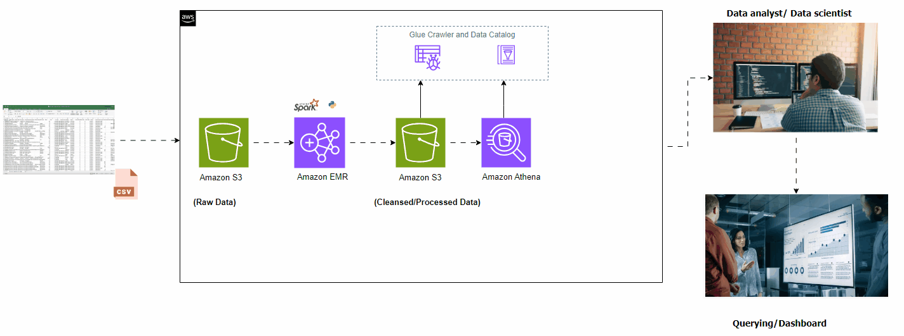 

 <br />
 
 

## Create an EMR Cluster

Before we create an EMR cluster we need to create a `Key Pair`, which we would need to access the EMR cluster's master node later on. So, lets create that first,

1. Login to your AWS account and navigate to the EC2 console, and click on **Key Pairs** option on the left menu bar. And then, click on `Create Key Pair`

2. Provide a name (`etl-emr-key`) for your key pair and click on `Create Key Pair`.

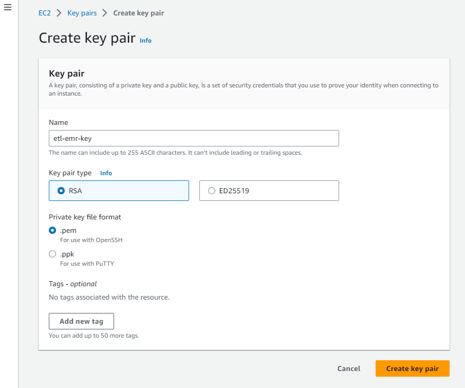

3. Now, we can go ahead and create an `Amazon EMR cluster`. For that navigate to Amazon EMR in the console and click on **Create Cluster** to create an EMR cluster

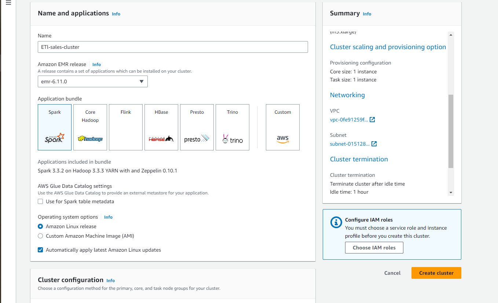

4. Provide some `Cluster name` to your EMR cluster, and select the emr version in my case emr-6.11.0 with:

   - **Latest release** of EMR under **Software configuration** section
   - **Spark: Spark 3.3.2 on Hadoop 3.3.3 YARN with and Zeppelin 0.10.1** under **Application** section,

   Select the right **EC2 key pair** (which you created in the previous step) under the **Security and access** section

   Keep everything else as default and click on **Create cluster**

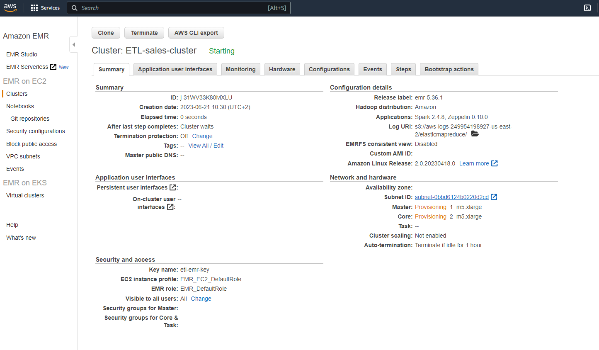

5. Cluster creation would take some time, and after couple of minutes, you will see that the cluster is **up and running** with a state as `Waiting` (which means the cluster is now ready and waiting to execute any ETL job)

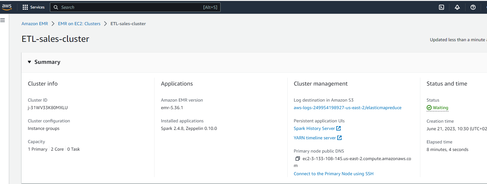

## Create an Amazon S3 bucket

Now we will create an Amazon S3 bucket and shall create two sub-folders within that, which will be used for store `RAW` and `CLEANSED` data

1. Navigate to the Amazon S3 console and click on **Create Bucket**

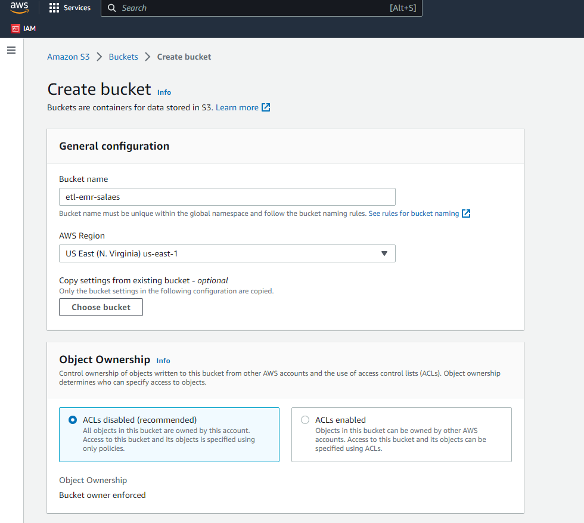

2. Create a **bucket** (e.g. `etl-emr-sales`)

3. Once the bucket is created, create two sub-folders namely
   - `cleaned-data`
   - `raw-data`

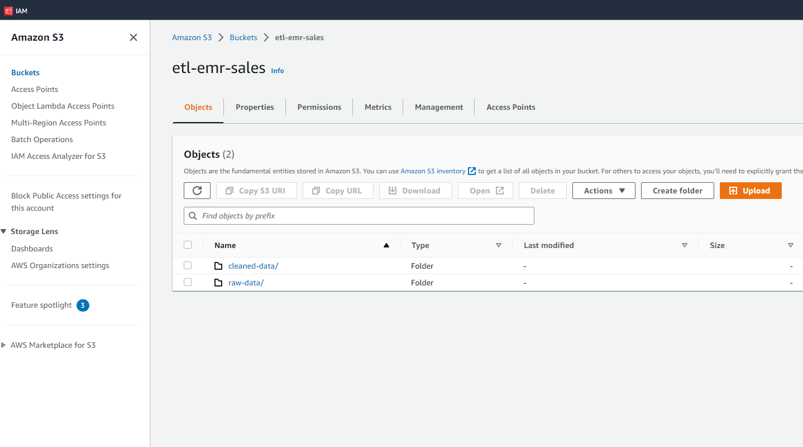

4. Upload the [sales dataset](https://myblog-imgs.s3.amazonaws.com/datasets/SalesData.csv) in the bucket under the folder `raw-data`

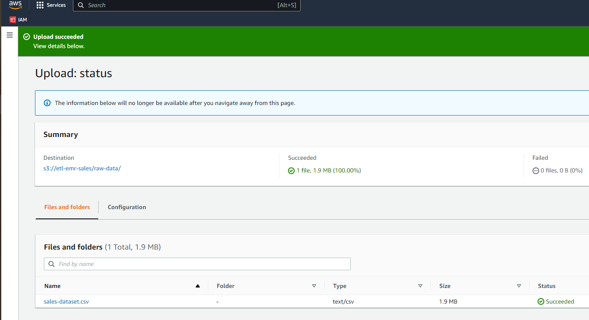

5. From security group edit inbound rules security group of master node.

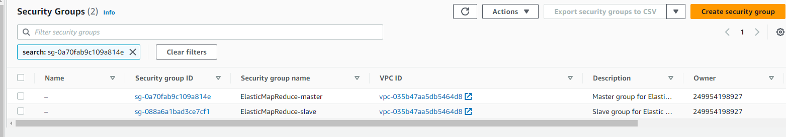

5. After editing inbound rules security group of master node, select `my ip `
   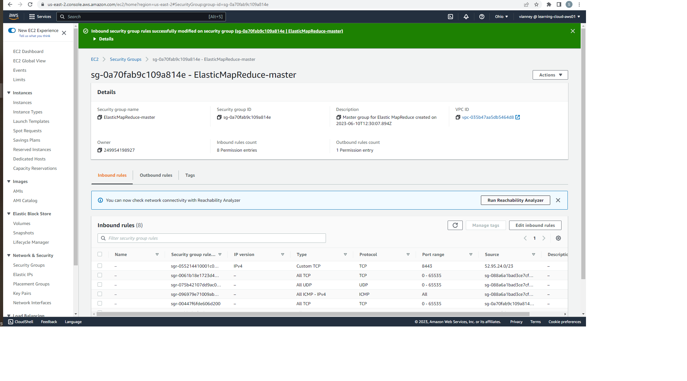

## Submit the PySpark job

Now, that we have the dataset uploaded in S3, its time to submit the PySpark job from our EMR cluster.

1. Navigate to the EMR console, select the `EMR cluster` which you created in earlier and click on **Connect to the Master Node Using SSH**

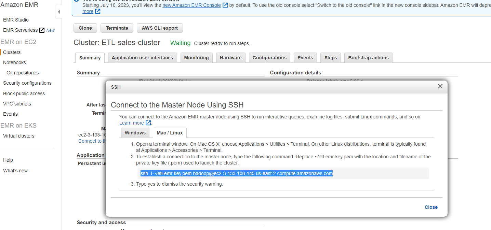

2. SSH to the EMR cluster's Master node from your terminal

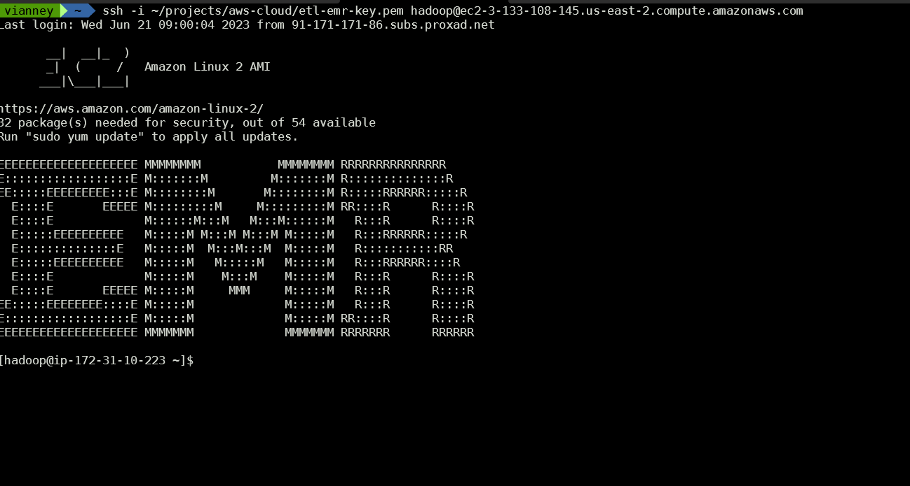

3. Copy the PySpark code [`etl-job.py`](/emr-etl-job.py) and save it in the `Master Node` and make the following changes and save the file:

   - `S3_SOURCE_DATA_PATH` = 's3:<YOUR_BUCKET_NAME>/raw-data/sales-dataset.csv'
   - `S3_DEST_DATA_PATH` = 's3:<YOUR_BUCKET_NAME>/cleaned-raw/'

```python

from pyspark.sql import SparkSession
from pyspark.sql import functions as F

S3_SOURCE_DATA_PATH = 's3:<YOUR_BUCKET_NAME>/raw-data/sales-dataset.csv'
S3_DEST_DATA_PATH = 's3:<YOUR_BUCKET_NAME>/cleaned-raw/'


def main():

    spark = SparkSession.builder.appName("ETL sales App").getOrCreate()
    spark.sparkContext.setLogLevel('ERROR')

    # Spark Dataframe (Raw)- Transformation
    df = spark.read.option("Header", True).option("InferSchema", True).csv(S3_SOURCE_DATA_PATH)

    replacements = {c:c.replace(' ','_') for c in df.columns if ' ' in c}
    final_df = df.select([F.col(c).alias(replacements.get(c, c)) for c in df.columns])

    print(f"Total no. of records in the source data set is : {final_df.count()}")

try:
    final_df.write.mode('overwrite').parquet(S3_DEST_DATA_PATH)
    print('The cleaned data is uploaded')
except:
    print('Something went wrong, please check the logs :P')

if __name__ == '__main__':
    main()

```

4. Submit the `PySpark job`

```bash
sudo spark-submit etl-job.py
```

5. Once the job **completes**, check the S3 bucket under the folder `cleaned-raw`, you will see the new transformed and processed data in `parquet` format


## Validating the output using Amazon Athena

Now, the `cleansed` data is available in Amazon S3 in the form of `parquet` format, but to make it more consumable for data analysts or data scientists, and it would be great if we could enable querying the data through SQL by making it available as a database table.

To make that integration, we can follow a two-step approach:

1. We need to run the Glue crawler to create a AWS Glue Data Catalog table on top of the S3 data.
2. Once that is done, we can run a query in Amazon Athena to validate the output

### Creating an AWS Glue Data Catalog

1. Navigate to the AWS Glue crawler console and click on **Create Crawler**

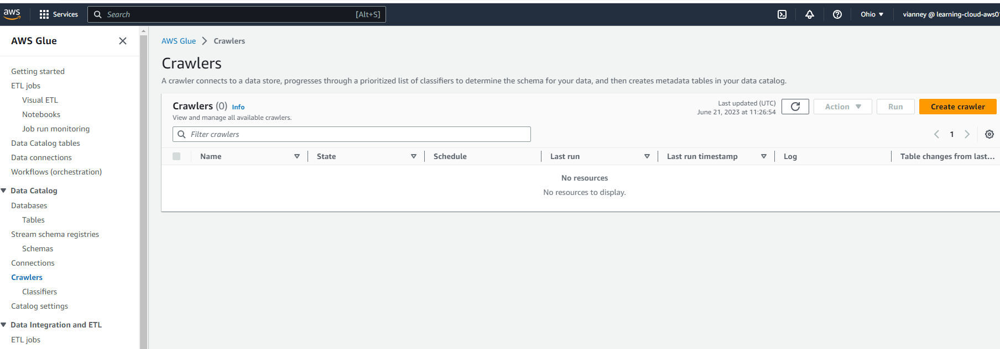

2. Give a **name** for the Glue Crawler (`etl-sales-crawler`)

3. Add the **data source** as S3 bucket where you have your cleansed and processed data (`s3://etl-emr-sales/cleaned-raw`)

4. Attach the **IAM role** (`AWSGlueServiceRole-default`)

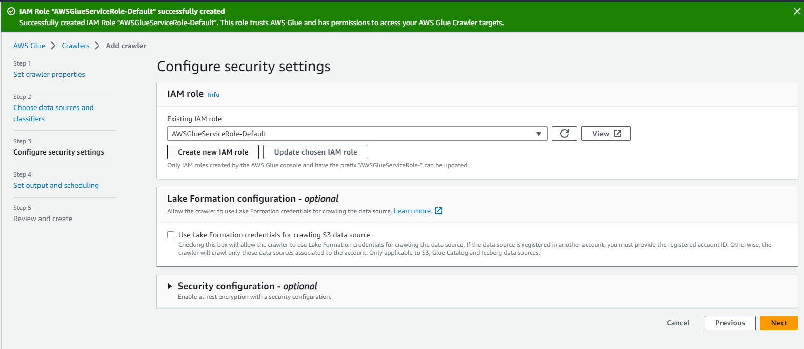

5. Create a **database** by clicking on **Add database** and select the same from dropdown menu (`sales-db`)

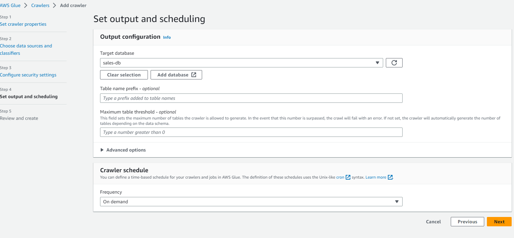

6. Review and verify all the details and click on **Create crawler**

7. Once the crawler is created, select the crawler and click on **Run**

8. Once the crawler finishes its run, you will see `detected tables`

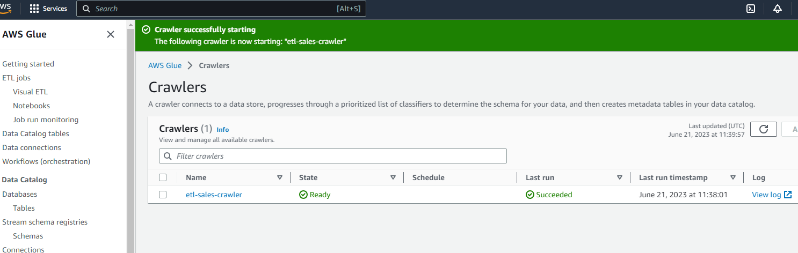

Now that we have the Glue Data Catalog table created, we can navigate to Amazon Athena to query the data using SQL.

### Querying output data using Amazon Athena standard SQL

1. Open Athena query editor, you can keep Data Source as the default `AwsDataCatalog` and select `sales-db` for Database and run the following query.

```sql
SELECT * FROM "sales-db"."cleaned-raw" limit 5;
```

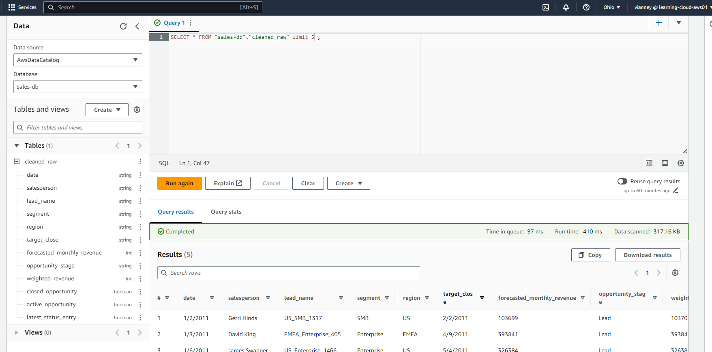

2. Now, you can perform other SQL queries to analyze the data. For example, if we would like to know the `forcast_monthly_revenue` for each `region per segment wise`, we can run this:

```sql
SELECT
    region,
    segment,
    SUM(forecasted_monthly_revenue) as forcast_monthly_revenue
FROM "sales-db"."cleaned-raw"
GROUP BY segment, region;

```

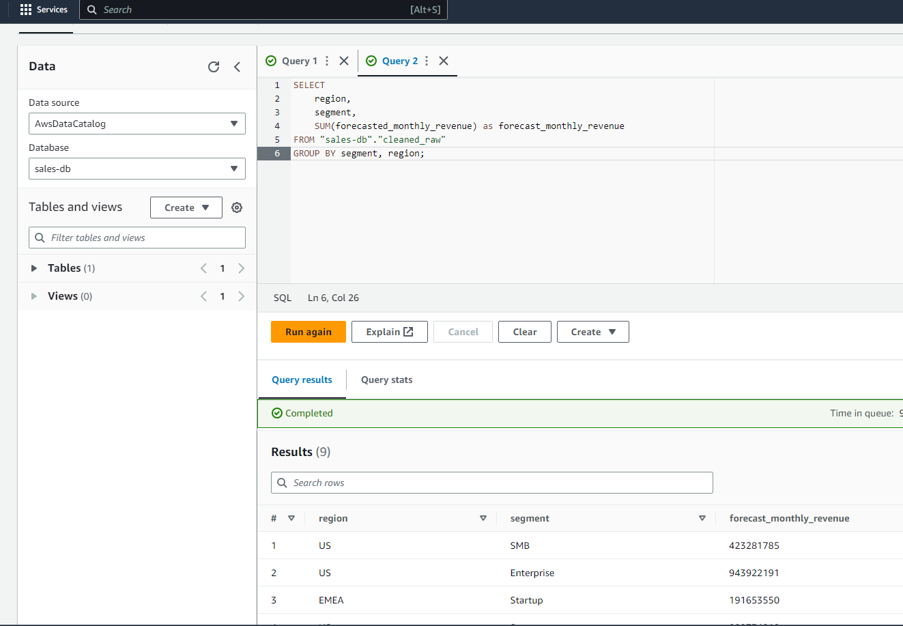

## Conclusion

Congratulations! You have finished the Creating an ETL Pipeline with Amazon EMR and Apache Spark tutorial. Continue your journey with AWS by following the next steps section below.

## Clean up

Now that you’ve finished this walk-through, you can delete all the following resources to avoid incurring unexpected costs

- Delete the **EMR Cluster**

- Delete the **Amazon S3 bucket**

```bash
aws s3 rb s3://etl-emr-sales --force
```

- Delete the **Glue Database**
